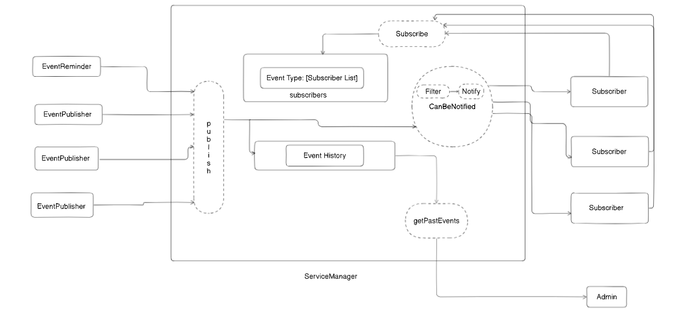

# Event-Driven-In-memory-Notification-System (JAVA)

This is a **modular**, **threaded**, and **in-memory** event-notification backend system built in **Java**, which mimics
notification workflows similar to systems like Google Calendar. It supports:

- Event publishing
- Subscriber management and filtering (priority/time)
- Scheduled event reminders
- Event history tracking
- Clean code and tested via JUnit 5

---

## System Design (What’s Happening)

At the core of the system lies the `ServiceManager`, which takes care of:

- **Subscription management:** Registering which subscriber wants what event type.
- **Publishing:** Routes events to only those subscribers who want them, based on:
    - Priority filter (high/low)
    - Time filter (working hours)
- **Event history:** Keeps past events and delivers them to admin on demand.

Other key roles:

- `EventPublisher`: Manually creates & pushes _**NewTaskEvent**_ events.
- `EventReminder`: Fires **_ReminderEvent_** events every 10 seconds (via ScheduledExecutorService).
- `Subscriber`: Has logic to decide if it wants to receive a certain event.
- `Admin`: Can ask the system to list all events in the past X hours.

The image below shows how it all flows:



---

## Project Structure

```
src
├── main
│   └── java
│       └── notification
│           ├── admin
│           │   └── Admin.java
│           ├── customExceptions
│           │   └── NullObjectException.java
│           ├── event
│           │   ├── CustomEvent.java
│           │   ├── NewTaskEvent.java
│           │   └── ReminderEvent.java
│           ├── publisher
│           │   ├── EventPublisher.java
│           │   └── EventReminder.java
│           ├── service
│           │   ├── EventLog.java
│           │   └── ServiceManager.java
│           ├── subscriber
│           │   └── Subscriber.java
│           └── Main.java
└── test
    └── java
        └── notification
            ├── concurrency
            │   ├── ConcurrentPublisherTest.java
            │   └── ConcurrentSubscriptionTest.java
            ├── event
            │   ├── CustomEventTest.java
            │   ├── NewTaskEventTest.java
            │   └── ReminderEventTest.java
            ├── publisher
            │   └── EventPublisherTest.java
            ├── service
            │   └── ServiceManagerTest.java
            └── subscriber
                └── SubscriberTest.java
```

---

## How to Run the App

Make sure you have Maven and Java 8+ installed.

### Step-by-step:

```bash
git clone https://github.com/Saqibxyz/Event-Driven-In-memory-Notification-System.git
 cd .\Event-Driven-In-memory-Notification-System\
```

1. **Compile the code**

```bash
mvn clean compile
```

2. **Run the application**

```bash
mvn exec:java
```

#### Make sure your `pom.xml` has below plugin for the above command to work

```
 <plugin>
      <groupId>org.codehaus.mojo</groupId>
      <artifactId>exec-maven-plugin</artifactId>
      <version>3.1.0</version>
      <configuration>
          <mainClass>notification.Main</mainClass>
      </configuration>
 </plugin>
```

---

## How to Run Tests

```bash
mvn test
```

---

## Example Run

```bash

[pool-1-thread-1] INFO notification.subscriber.Subscriber - Mohsin  received ReminderEvent at 31/07/25 03:26:05
[notification.Main.main()] INFO notification.subscriber.Subscriber - Saqib  received NewTaskEvent at 31/07/25 03:26:05
[notification.Main.main()] INFO notification.subscriber.Subscriber - Saqib  received NewTaskEvent at 31/07/25 03:26:05
[notification.Main.main()] INFO notification.subscriber.Subscriber - Yawar  received NewTaskEvent at 31/07/25 03:26:05
[notification.Main.main()] INFO notification.admin.Admin - [31/07/25 03:26] ReminderEvent - This is a reminder : [Mohsin]
[notification.Main.main()] INFO notification.admin.Admin - [31/07/25 03:26] NewTaskEvent - review project : [Saqib]
[notification.Main.main()] INFO notification.admin.Admin - [31/07/25 03:26] NewTaskEvent - handle exceptions : [Saqib, Yawar]
[notification.Main.main()] INFO notification.subscriber.Subscriber - Saqib  received NewTaskEvent at 31/07/25 03:26:05
[notification.Main.main()] INFO notification.subscriber.Subscriber - Zahid  received NewTaskEvent at 31/07/25 03:26:05
[notification.Main.main()] INFO notification.admin.Admin - [31/07/25 03:26] ReminderEvent - This is a reminder : [Mohsin]
[notification.Main.main()] INFO notification.admin.Admin - [31/07/25 03:26] NewTaskEvent - review project : [Saqib]
[notification.Main.main()] INFO notification.admin.Admin - [31/07/25 03:26] NewTaskEvent - handle exceptions : [Saqib, Yawar]
[notification.Main.main()] INFO notification.admin.Admin - [31/07/25 03:26] NewTaskEvent - Check bugs : [Saqib, Zahid]
[pool-1-thread-1] INFO notification.subscriber.Subscriber - Mohsin  received ReminderEvent at 31/07/25 03:26:15
[pool-1-thread-1] INFO notification.subscriber.Subscriber - Sahib  received ReminderEvent at 31/07/25 03:26:15
```

- The ReminderEvent fires every 10 seconds.
- Subscribers are filtered according to:
    - working hours (`LocalTime`)
    - preference flags (`isPreferringHighPriorityEvents`, `isPreferringEventsDuringWorkingHours`)

---

## Notable Features

- **Singleton ServiceManager** (one event bus)
- **Event filtering** based on real-time conditions
- **Multithreading** via `ScheduledExecutorService` for timed events
- **EventLog** tracking and stream-filtered history

---

## Credits

_Made by **_Saqib Ayoub_**_


